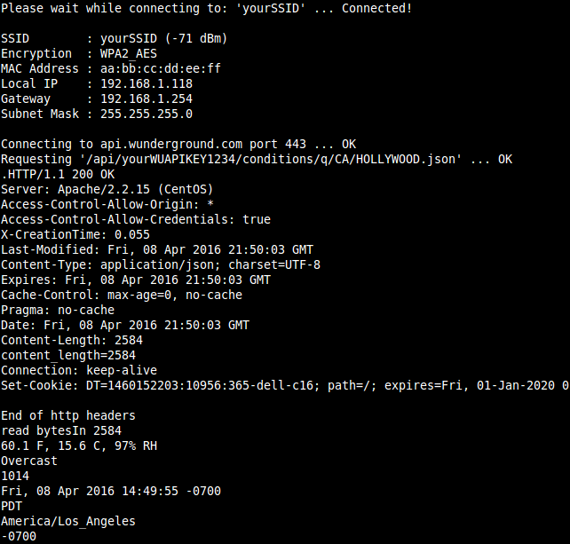

# Weather Underground with Adafruit Feather WICED

Get weather current conditions from Weather Underground using the Adafruit
Feather WICED board and TLS.

Open the IDE Serial Monitor to see the program output. It should look like the
above image.
